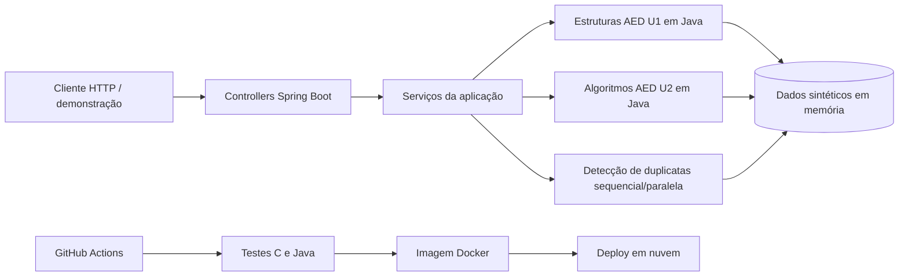

# Plano de aplicação e entregas — Rota Vital (AED + SO)

**Equipe:** Eduardo Borges; Luiz Henrique Rocha; Eliziane Mota; Pedro Iranildo; Ricardo Severiano de Souza Filho  
**Atualizado em:** 23/09/2026  
**Escopo autorizado pela direção:** somente Algoritmos e Estruturas de Dados (AED) e Infraestrutura de Software (SO).

## 1. Decisão central

O projeto de threads já entregue será a **base da aplicação**, não um trabalho isolado a ser descartado. Ele já possui Java 21, Spring Boot 3.3.3, Maven, endpoint REST, serviço, testes e documentação. As estruturas de AED e os próximos algoritmos entrarão nessa mesma aplicação.

O resultado final será um único backend Rota Vital que demonstra:

1. **SO:** processamento de duplicatas sequencial, paralelo com 2/4/8 threads e opcionalmente virtual threads; CI/CD; deploy; sincronização; arquitetura em três cenários e orçamento.
2. **AED U1:** estoque em lista, requisições em fila e histórico em pilha quando efetivamente usado, em C e Java, com inserção, remoção e consulta.
3. **AED U2:** hash, FEFO, matriz ABO/Rh e vizinho mais próximo, em C e Java, integrados ao atendimento de uma requisição.

O grupo não precisa construir telas, painéis estatísticos, topologia de redes nem o CRUD completo das matérias em que não está matriculado. A API REST será suficiente para demonstrar AED e fornecer uma aplicação real para SO.

## 2. Situação da entrega de threads

### Já concluído e reaproveitável

| Evidência recebida | Situação | Uso no PI |
|---|---|---|
| Endpoint `GET /api/duplicates/detect` | Concluído | Serviço real da camada de aplicação para SO |
| Versão sequencial | Concluído | Baseline de desempenho |
| `ExecutorService` com 2, 4 e 8 threads | Concluído | Evidência principal de paralelismo |
| Contadores locais e agregação por `Future` | Concluído | Evita escrita compartilhada no laço e sustenta a análise de corrida |
| Virtual threads Java 21 | Concluído, opcional | Comparação adicional entre threads virtuais e de plataforma |
| Dados sintéticos determinísticos | Concluído | Repetição funcional com a mesma entrada |
| JUnit de equivalência sequencial/paralelo | Concluído | Evidência de mesma resposta e ausência de divergência |
| Tabela, gráfico, speedup, Big-O e análise | Concluído | Relatório de concorrência e desempenho de SO U1 |
| PDF de cinco páginas | Concluído | Evidência formal da atividade de threads |

Os relatórios incluídos no ZIP registram **21 testes sem falha**. Na revisão feita em 23/09, o `mvnw.cmd test` não iniciou neste computador por uma falha do script Maven Wrapper. Isso não invalida os relatórios existentes, mas precisa ser corrigido antes de chamar o projeto de reproduzível.

### O que a entrega de threads ainda não cobre

- Não há `README.md` com instruções completas de execução.
- Não há workflow de CI em `.github/workflows/`.
- Não há `Dockerfile`, endpoint de saúde ou evidência de deploy público.
- As medições têm um valor por configuração e medem `processingTimeMs` dentro do endpoint; para uma evidência mais forte, adicionar aquecimento e múltiplas repetições, registrando mediana.
- O endpoint limita a entrada a 20.000 registros e as medições reais vão até 8.000. O relatório justifica a extrapolação para 100 mil e 1 milhão. Manter essa justificativa e confirmar com o professor se a geração nesses volumes era obrigatória ou apenas exemplificativa.
- A entrega não implementa as estruturas ou algoritmos de AED.

**Conclusão:** a atividade cobre a parte de **threads, ganho mensurável e igualdade de resultado** de SO U1. Ainda faltam CI/CD e deploy para completar SO U1, além de todo o trabalho próprio de AED.

## 3. Prazos

A postagem do professor de AED mostra as seguintes datas:

| Entrega | Prazo-base | Fechamento interno |
|---|---|---|
| AED AV1 / U1 | **02/10/2026** | **01/10/2026** |
| AED AV2 / U2 | **04/12/2026** | **02/12/2026** |
| SO U1 e SO U2 | Data própria ainda não fornecida | Usar 01/10 e 02/12 como marcos internos enquanto isso |

O ano foi inferido do semestre 2026.2; a imagem corta o ano e o horário. Confirmar o horário de AED e os prazos oficiais de SO na plataforma. Em 23/09 restam **9 dias corridos** para AED AV1.

As células da planilha que parecem `05/04/2026` e `07/06/2026` correspondem às faixas **semanas 4–5 e 6–7** no PDF. Elas não são datas de entrega.

## 4. Arquitetura da aplicação



O código em C será executável e testável separadamente, mas usará as mesmas entidades, operações e fixtures da versão Java. A aplicação Spring Boot consome a versão Java. Isso preserva a equivalência didática exigida sem tentar chamar código C pela JVM.

### Estrutura recomendada do repositório

```text
rota-vital/
  pom.xml                         projeto Spring Boot existente
  mvnw / mvnw.cmd                Maven Wrapper corrigido e testado
  src/main/java/com/rotavital/
    controller/                  controllers existentes + estoque/requisições/alocação
    service/                     serviços de aplicação, incluindo duplicatas
    domain/                      Bolsa, Requisicao, Hospital, rota e tipos sanguíneos
    aed/u1/                      lista, fila e pilha Java
    aed/u2/                      hash, FEFO, matriz ABO/Rh e rota Java
    util/                        FuzzyMatcher existente
  src/test/java/com/rotavital/   testes unitários e de integração
  aed-c/
    include/                     contratos e estruturas C
    src/u1/                      lista, fila e pilha
    src/u2/                      hash, FEFO, matriz e rota
    tests/                       testes C com as mesmas fixtures
    Makefile
  fixtures/                      dados sintéticos e resultados esperados
  bench/                         CSV, gráfico e scripts da atividade de threads
  docs/
    threads/                     PDF e documentação já entregues, preservados
    equivalencia-u1.md
    equivalencia-u2.md
    complexidade-u2.md
    arquitetura-so-u2.md
    dominio-tatico.md
  .github/workflows/ci.yml
  Dockerfile
  README.md
```

## 5. Stack definitiva

| Área | Stack | Decisão |
|---|---|---|
| Aplicação | **Java 21 + Spring Boot 3.3.3** | Manter a versão já usada e testada; não atualizar durante a AV1 sem necessidade concreta |
| Build e testes Java | Maven Wrapper + JUnit 5 + Spring Boot Test | Corrigir o wrapper e executar testes em máquina limpa e no CI |
| Concorrência | `ExecutorService`, pool fixo 2/4/8; virtual threads opcionais | Preservar a implementação e os resultados já entregues |
| AED C | C11 + GCC + Makefile + AddressSanitizer/UBSan no CI Linux | Evidenciar `malloc/free`, ponteiros e erros de memória |
| AED Java | Nós e estruturas próprias em Java, testadas por JUnit | Reproduzir a lógica C e expor operações para os serviços Spring |
| API | REST/JSON; Spring MVC; validação de entrada | Demonstração sem interface gráfica |
| Dados | Dados sintéticos em memória na U1 | Evita introduzir banco antes de ele ser necessário para os critérios das duas matérias |
| Saúde | Spring Boot Actuator `/actuator/health` | Verificação automática do deploy |
| CI/CD | GitHub Actions | Compilar/testar C, testar/empacotar Java, construir imagem e liberar deploy após sucesso |
| Contêiner | Docker | Mesmo artefato em desenvolvimento, CI e nuvem |
| Nuvem inicial | Render via Docker, sujeito à confirmação da conta e dos limites vigentes | URL pública e demonstração simples; dados continuam regeneráveis |

## 6. Divisão entre cinco integrantes

Cada pessoa responde por código, testes, documentação e demonstração de sua parte. Toda parte deve ser revisada por outra pessoa.

| Integrante | Função principal | Entregas U1 | Entregas U2 | Revisor |
|---|---|---|---|---|
| **Eduardo Borges** | Coordenação técnica e AED em C | Modelo do domínio; lista de estoque em C; integração das estruturas C; consolidação da AV1 | Revisão do fluxo completo e domínio tático | Luiz |
| **Luiz Henrique Rocha** | AED em C e algoritmos de índice/prioridade | Fila de requisições e pilha de histórico em C; testes C; sanitizers | Hash e FEFO em C e Java; complexidade dessas partes | Eduardo e Eliziane |
| **Eliziane Mota** | AED Java e integração algorítmica | Lista/fila/pilha Java; JUnit; equivalência C → Java; endpoints U1 com Ricardo | Matriz ABO/Rh e vizinho mais próximo em C e Java; integração dos quatro algoritmos | Eduardo e Luiz |
| **Pedro Iranildo** | SO, concorrência e desempenho | Curadoria da entrega de threads; correção do método de benchmark; validação de igualdade e desempenho | Sincronização sob carga; três cenários de uso; arquitetura e análise de escala | Ricardo |
| **Ricardo Severiano de Souza Filho** | Aplicação, CI/CD e nuvem | Incorporar a base Spring; corrigir Maven Wrapper; README; Actuator; Docker; CI; deploy; endpoints com Eliziane | Deploy de ponta a ponta; orçamento dos três cenários; evidências de commit → produção | Pedro e Eliziane |

Se outra pessoa tiver sido autora da atividade de threads, isso não altera a autoria acadêmica. A tabela define quem mantém e integra o artefato a partir de agora.

## 7. Plano imediato até a AV1

### 23/09 — congelar e incorporar a base

- Ricardo cria o repositório definitivo a partir do conteúdo de `threads-2.zip`.
- Pedro guarda o PDF, CSV, gráfico e fontes da atividade em `docs/threads/` e `bench/`, sem alterar os resultados históricos.
- Ricardo corrige o Maven Wrapper e adiciona `README.md` com requisitos e comandos.
- Eduardo publica os contratos mínimos de `Bolsa`, `Requisicao` e operações esperadas.
- **Saída:** `mvnw test` executa do zero; o serviço de duplicatas continua funcionando; nenhuma evidência anterior foi perdida.

### 24–26/09 — implementar AED U1 em paralelo

- Eduardo: lista encadeada de estoque em C, com inserir, consultar, remover e liberar.
- Luiz: fila encadeada de requisições em C e, se utilizada pelo sistema, pilha de histórico.
- Eliziane: versões Java logicamente equivalentes, com nós próprios e os mesmos casos de teste.
- Ricardo: controllers/services que chamam as estruturas Java de verdade.
- Pedro: valida que a aplicação de threads continua compilando e separa o benchmark da lógica de AED.
- **Saída:** fixtures iguais produzem os mesmos resultados em C e Java; endpoints conseguem demonstrar estoque e requisições.

### 27–28/09 — testes e tradução comentada

- Luiz executa GCC com avisos, AddressSanitizer e UndefinedBehaviorSanitizer.
- Eliziane fecha JUnit de estrutura vazia, primeiro elemento, vários elementos, consulta inexistente, remoção e ordem FIFO/LIFO.
- Eduardo e Eliziane escrevem `equivalencia-u1.md`, ligando cada função C ao método Java e aos ponteiros/nós realmente implementados.
- Pedro reforça a evidência da atividade de threads com aquecimento e repetições se houver tempo; os números antigos permanecem identificados como entrega original.
- **Saída:** testes verdes e documentação ligada ao código real.

### 29–30/09 — SO e integração

- Ricardo cria CI com jobs separados para C e Java, adiciona Actuator e Dockerfile e realiza o primeiro deploy.
- Pedro confere a URL, health check, limite de threads e reprodução das medições.
- Todos executam uma instalação limpa: clonar, testar C, testar Java, iniciar API e chamar endpoints.
- **Saída:** CI verde, URL pública e roteiro de demonstração reproduzível.

### 01/10 — congelamento

- Eduardo confere o checklist de AED U1.
- Pedro e Ricardo conferem o checklist de SO U1.
- O grupo gera o pacote final, anota o commit e ensaia a demonstração.
- **Saída:** versão da AV1 pronta um dia antes do prazo.

### 02/10 — submissão AED AV1

- Submeter antes do horário indicado na plataforma.
- SO segue sua data própria quando confirmada; o mesmo commit já deve conter as evidências de SO disponíveis.

## 8. Plano da AV2

| Período | Trabalho | Marco |
|---|---|---|
| **03–09/10** | Definir grafo de 5–8 pontos, matriz didática para concentrado de hemácias, chaves do hash e regras de desempate FEFO | Fixtures e resultados esperados aprovados antes do código |
| **10–23/10** | Luiz implementa hash/FEFO; Eliziane implementa matriz/rota; versões C e Java caminham juntas | Quatro algoritmos com testes isolados nas duas linguagens |
| **24/10–06/11** | Integrar em Java: pedido → hash → filtro compatibilidade/validade → FEFO → rota; expor endpoint real | Fluxo completo funciona sem resposta fixa |
| **07–20/11** | Pedro testa sincronização e carga; Ricardo fecha arquiteturas, custos e deploy; Eduardo fecha domínio tático | SO U2 documentada e testada |
| **21–27/11** | Completar tradução C/Java e Big-O baseada no código; executar casos de erro e integração | Documentação e testes completos |
| **30/11–02/12** | Ensaio, correções, congelamento e pacote | Fechamento interno em 02/12 |
| **03–04/12** | Conferência e submissão | AED AV2 entregue em 04/12 |

## 9. Critérios de aceite por entrega

### AED U1

- Lista de estoque e fila de requisições em C e Java; pilha somente se houver histórico real.
- `malloc/free` e ponteiros explícitos em C; teste sem vazamento/erro de memória.
- Inserir, remover e consultar testados nas duas linguagens.
- Mesmas fixtures e mesmos resultados C/Java.
- Tradução comentada específica, citando funções, métodos, cabeça, cauda, próximo nó e liberação de memória.
- Java consumido pela aplicação Spring, sem constantes ou caminhos que impeçam integração.

### SO U1

- Atividade de threads preservada: endpoint, sequencial, 2/4/8 threads, igualdade, tabela, gráfico, speedup e análise.
- Build limpo reproduzível pelo Maven Wrapper.
- Pipeline executa testes C e Java e constrói o artefato.
- Aplicação implantada e acessível por URL; health check responde.
- README explica build, teste, execução, benchmark e deploy.

### AED U2

- Hash, FEFO, matriz ABO/Rh e vizinho mais próximo em C e Java.
- Testes incluem colisão de hash, validade vencida, empate FEFO, compatibilidade/incompatibilidade, estoque vazio e rota indisponível.
- Fluxo Java integrado e chamado pela API.
- Tradução comentada dos quatro algoritmos e complexidade justificada pelos laços e operações reais.

### SO U2

- Três cenários de carga com arquitetura coerente e orçamento mensal datado e calculado.
- Sincronização do estado compartilhado explicada e validada sob repetição/carga.
- Demonstração reproduzível de commit → testes → build → deploy → health check.
- Documento curto de domínio tático com entidades, agregados, objetos de valor, eventos e necessidade de cada camada, cobrindo a rubrica adicional da planilha.

## 10. Riscos e decisões

| Risco | Ação |
|---|---|
| Reescrever a atividade de threads e perder evidência | Preservar fontes, CSV, gráfico e PDF; apenas integrar e corrigir reprodutibilidade |
| Maven Wrapper continuar falhando | Corrigir/substituir pelos arquivos oficiais da mesma versão e validar em Windows e CI Linux |
| A aplicação virar um conjunto de endpoints sem lógica integrada | Controllers apenas chamam serviços; serviços usam estruturas AED reais |
| Falta de tempo até 02/10 | U1 primeiro; nenhum trabalho de U2 antes de lista/fila C/Java, testes e tradução estarem prontos |
| Professor exigir 100 mil/1 milhão reais na atividade de threads | Confirmar; se exigido, gerar os datasets, mas medir com estratégia segura e documentar por que o algoritmo quadrático não conclui em tempo razoável |
| Banco de dados consumir tempo sem critério avaliativo | Manter dados sintéticos em memória na U1; introduzir persistência somente se o professor exigir |
| Datas de SO divergirem das de AED | Verificar a plataforma de SO imediatamente e antecipar os marcos se necessário |

## 11. Fontes consideradas

- `PI_ADS_2026.2_3o_Semestre.docx.pdf` e `PI_ADS_2026.2_3o_Semestre.xlsx`: escopo, entregas e rubricas de AED e SO.
- Captura da plataforma do professor de AED: datas visíveis de 2 de outubro e 4 de dezembro; ano e horário cortados.
- `threads-2.zip`: projeto Spring Boot, testes, medições, gráfico e documentação da atividade de threads.
- `RotaVital_Threads_Relatorio.pdf`: relatório formal de cinco páginas da atividade já entregue.
