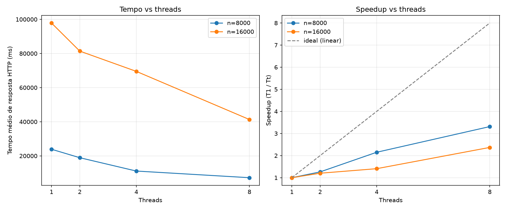

# Medições — Sequencial vs. threads

Série única publicada em **06/10/2026**, baseada em [dados brutos](../bench/measurements.csv). São 40 execuções: tamanhos 8.000 e 16.000, modo `platform`, 1, 2, 4 e 8 threads, cinco repetições por configuração.

## Método e evidências

O endpoint é `GET /api/duplicates/detect?size={n}&threads={t}&mode=platform`. Com uma thread, o controlador chama a versão sequencial; com mais threads, usa um pool fixo. `DataGeneratorService` gera nomes sintéticos de medicamentos com seed 42 e possíveis erros de digitação.

O script [measure.ps1](../bench/measure.ps1) prevê uma execução de aquecimento com 8.000 registros e uma thread, excluída do CSV. Isso reduz efeitos de inicialização, mas não garante que todos os efeitos da JVM sejam eliminados. O projeto requer Java 21; o CSV não registra hardware, sistema operacional nem versão exata do JDK da coleta.

`responseTimeMs` é o tempo de parede medido pelo cliente com `Stopwatch` ao redor de `Invoke-RestMethod`. Inclui chamada HTTP, processamento no servidor e retorno ao cliente. `processingTimeMs` mede internamente apenas a detecção; a tabela usa exclusivamente `responseTimeMs`.

Para cada configuração, `Tt = soma(responseTimeMs das cinco repetições) / 5`. O speedup é `T1 / Tt`, com a mesma entrada. Os valores são arredondados a duas casas após o cálculo.

Todas as 40 linhas registram `SUCCESS`. Para 8.000 registros, todas retornam 3.198.218 pares duplicados; para 16.000, 12.801.507. A igualdade sustenta a equivalência nesta série, sem constituir prova geral de ausência de falhas de concorrência. `DuplicateDetectionServiceTest` contém testes automatizados de equivalência entre versões e casos de borda.

## Resultados atuais

| n | threads | modo | média HTTP (ms) | speedup |
|---|---|---|---|---|
| 8000 | 1 | platform | 23883.00 | 1.00x |
| 8000 | 2 | platform | 18925.60 | 1.26x |
| 8000 | 4 | platform | 11105.20 | 2.15x |
| 8000 | 8 | platform | 7209.80 | 3.31x |
| 16000 | 1 | platform | 97867.00 | 1.00x |
| 16000 | 2 | platform | 81400.00 | 1.20x |
| 16000 | 4 | platform | 69518.20 | 1.41x |
| 16000 | 8 | platform | 41297.40 | 2.37x |

O tempo sequencial cresce `97867 / 23883 ≈ 4,10x` ao dobrar a entrada. Esse comportamento é compatível com o custo quadrático de pares, mantendo textos de tamanho semelhante; dois tamanhos não provam empiricamente a complexidade.

Há variação entre repetições, especialmente em 16.000 registros e duas threads: de 72.741 a 102.051 ms. A média inclui todas as cinco observações. Os dados não permitem atribuir essa variação a utilização de CPU, temperatura ou outros processos. Nenhuma virtual thread foi medida nesta série.

## Escala do enunciado e limites

100 mil e 1 milhão de registros são exemplos de escala do enunciado, sem execuções correspondentes no CSV. O endpoint atual limita `size` a 20.000 e `threads` a quatro vezes os processadores disponíveis à JVM.

Uma estimativa ilustrativa, mantendo o mesmo custo por par, aplica `T(n) = 23883 × (n / 8000)²` ms à média sequencial atual:

| n | tempo sequencial estimado, sem execução |
|---|---|
| 100.000 | ≈ 3.731,72 s (1,04 h) |
| 1.000.000 | ≈ 373.171,88 s (4,32 dias) |

Esses números dependem de textos, recursos e condições semelhantes. Não são previsões validadas; não se extrapola um speedup constante, pois ele já varia entre os dois tamanhos medidos. A [justificativa](justificativa.md) explica a Big-O; a [análise](analise.md) discute limites e propostas futuras.

## Gráfico e reprodução



O gráfico em `docs/speedup.png` é uma cópia do [gráfico de benchmark](../bench/speedup.png). O script [plot_speedup.py](../bench/plot_speedup.py) recalcula [o CSV agregado](../bench/measurements_agg.csv) e os gráficos a partir da série bruta, sem executar nova coleta:

```bash
python bench/plot_speedup.py
```

Para validar os dados sem gerar arquivos nem carregar `matplotlib`, e executar os testes do script:

```bash
python bench/plot_speedup.py --check
python -m unittest discover -s bench -p "test_*.py"
```

Para gerar o relatório PDF a partir dos Markdown e do CSV agregado:

```bash
python bench/build_report.py
```

Execute na raiz do projeto com Python 3.12+. Para gerar os gráficos e o PDF, instale as dependências fixadas em `bench/requirements.txt`: `matplotlib==3.11.2` e `reportlab==4.4.9`.

```bash
python -m pip install -r bench/requirements.txt
```

O [README](../README.md#benchmark-de-paralelismo-threads) inclui instalação em ambiente isolado. O [relatório PDF](RotaVital_Threads_Relatorio.pdf) reúne a entrega documental.
